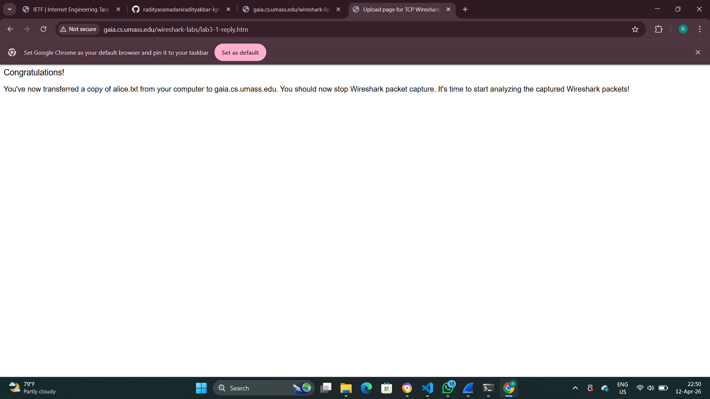

# Laporan Praktikum JarKom IF
# Laporan Praktikum Jaringan Komputer Week 6

## Keterangan
- Nama : Mochammad Raditya Ramadani Akbar
- NIM : 103072400039
- Kelas : IF 04-05
- Mata Kuliah : Praktikum Jaringan Komputer (JarKom)
- Modul : 6 (TCP)

## Tujuan Praktikum

1. Memahami cara kerja protokol TCP (Transmission Control Protocol) secara detail.
2. Menganalisis proses pengiriman data antara client dan server menggunakan TCP.
3. Mengamati proses three-way handshake (SYN, SYN-ACK, ACK) dalam pembentukan koneksi TCP.
4. Mempelajari penggunaan sequence number dan acknowledgment number dalam komunikasi TCP.
5. Mengidentifikasi cara TCP menjamin keandalan (reliability) dalam pengiriman data.
6. Menganalisis mekanisme flow control dan congestion control pada TCP.
7. Menggunakan aplikasi Wireshark untuk menangkap dan menganalisis paket jaringan.
8. Menghitung performa jaringan seperti:
   - RTT (Round Trip Time)
   - Throughput

## Analisis Transfer File Menggunakan Protokol TCP

## Langkah Pengerjaan
1. Download file
   http://gaia.cs.umass.edu/wireshark-labs/alice.txt

   

2. Buka Browser
   http://gaia.cs.umass.edu/wireshark-labs/TCP-wireshark-file1.html

   
   

3. Buka Wireshark, pilih wifi, lalu klik start

4. Kembali ke browser klik Upload alice.txt dan pastikan jangan sampai salah
   

5. Stop Wireshark dan lakukan filter "TCP"
   

   Setelah proses capture dihentikan di aplikasi Wireshark, lakukan penyaringan paket menggunakan filter “tcp”. Dari hasil tersebut terlihat bahwa paket yang tertangkap terdiri dari segmen TCP serta beberapa paket HTTP. Hal ini menunjukkan bahwa proses pengunggahan file dilakukan melalui protokol HTTP yang berjalan di atas lapisan TCP.
   
   Segmen dengan flag SYN digunakan untuk memulai koneksi antara client dan server melalui mekanisme three-way handshake. Tahapan ini bukan untuk mengirim data, melainkan memastikan bahwa koneksi telah terbentuk dengan baik sebelum proses transfer data dimulai. Setelah koneksi berhasil dibuat, data file akan dikirim melalui TCP dalam bentuk beberapa segmen kecil. Pemecahan data ini bertujuan agar proses pengiriman menjadi lebih efisien dan mudah dikendalikan.
   
   Setelah seluruh data berhasil dikirim, server memberikan respon berupa HTTP/1.1 200 OK. Respon ini menandakan bahwa file telah diterima dan diproses dengan baik oleh server. Selanjutnya, halaman web akan menampilkan pesan “Congratulations” sebagai indikasi bahwa proses upload telah berhasil dilakukan.

## Jawaban Pertanyaan
1. Berapa alamat IP dan nomor port TCP yang digunakan oleh komputer klien (sumber) untuk 
   mentransfer file ke gaia.cs.umass.edu? Cara paling mudah menjawab pertanyaan ini adalah 
   dengan memilih sebuah pesan HTTP dan meneliti detail paket TCP yang digunakan untuk 
   membawa pesan HTTP tersebut.

   

   - IP ini adalah alamat komputer pengirim (client)
   - Port bersifat acak (ephemeral) dan digunakan sementara selama koneksi

2. Apa alamat IP dari gaia.cs.umass.edu? Pada nomor port berapa ia mengirim dan menerima 
   segmen TCP untuk koneksi ini?
   Jika Anda telah membuat trace Anda sendiri, jawab pertanyaan berikut:
   
   

   - Port 80 adalah standar untuk HTTP
   - Server menggunakan port ini untuk:
      - menerima request (POST)
      - mengirim response (HTTP 200 OK)

## Dasar TCP

## Langkah Pengerjaan
1. Download dan Extract file
   http://gaia.cs.umass.edu/wireshark-labs/wireshark-traces.zip

2. Buka file tcp-ethereal-1 dengan Wireshark
   

## Jawaban Pertanyaan
1. Berapa nomor urut segmen TCP SYN yang digunakan untuk memulai sambungan TCP antara 
   komputer klien dan gaia.cs.umass.edu? Apa yang dimiliki segmen tersebut sehingga
   teridentifikasi sebagai segmen SYN?
   

   - Paket ini adalah awal koneksi TCP
   - Disebut SYN karena hanya flag SYN aktif
   - Sequence number biasanya 0 (relative) karena Wireshark menyederhanakan angka asli

2. Berapa nomor urut segmen SYNACK yang dikirim oleh gaia.cs.umass.edu ke komputer klien 
   sebagai balasan dari SYN? Berapa nilai dari field Acknowledgement pada segmen SYNACK? 
   Bagaimana gaia.cs.umass.edu menentukan nilai tersebut? Apa yang dimiliki oleh segmen 
   sehingga teridentifikasi sebagai segmen SYNACK?
   

   - Ini adalah balasan dari server
   - ACK = Seq SYN + 1 → tanda SYN sudah diterima
   - Kombinasi SYN + ACK menunjukkan tahap kedua handshake

3. Berapa nomor urut segmen TCP yang berisi perintah HTTP POST? Perhatikan bahwa untuk 
   menemukan perintah POST, Anda harus menelusuri content field milik paket di bagian 
   bawah jendela Wireshark, kemudian cari segmen yang berisi "POST" di bagian field DATAnya.
   

   - Paket ini berisi data file yang dikirim
   - POST digunakan untuk upload file ke server
   - Ini adalah awal transfer data sebenarnya

4. Anggap segmen TCP yang berisi HTTP POST sebagai segmen pertama dalam koneksi TCP. Berapa nomor urut dari enam segmen pertama dalam TCP (termasuk segmen yang berisi HTTP POST)?
   Pada jam berapa setiap segmen dikirim? Kapan ACK untuk setiap segmen diterima? Dengan adanya perbedaan antara kapan setiap segmen TCP dikirim dan kapan 
   acknowledgement-nya diterima, berapakah nilai RTT untuk keenam segmen tersebut? Berapa nilai EstimatedRTT setelah penerimaan setiap ACK? (Catatan: Wireshark memiliki fitur yang memungkinkan Anda untuk memplot RTT untuk setiap segmen TCP yang dikirim. Pilih segmen TCP yang dikirim dari klien ke server gaia.cs.umass.edu pada jendela "daftar paket yang ditangkap". Kemudian pilih: Statistics->TCP Stream Graph- >Round Trip Time Graph).
   

   - RTT = waktu dari paket dikirim sampai ACK diterima
   - RTT menunjukkan kecepatan respon jaringan
   - Semakin kecil RTT → semakin cepat koneksi

5. Berapa panjang setiap enam segmen TCP pertama?
   

   - Biasanya ≈ 1460 byte
   - Ini adalah MSS (Maximum Segment Size)
   - TCP membagi data agar:
      - efisien
      - menghindari fragmentasi

6. Berapa jumlah minimum ruang buffer tersedia yang disarankan kepada penerima dan
   diterima untuk seluruh trace? Apakah kurangnya ruang buffer penerima pernah 
   menghambat pengiriman?
   

   - Window size = kapasitas buffer penerima
   - Jika kecil → pengiriman bisa terhambat
   - Jika besar → transfer lebih lancar

7. Apakah ada segmen yang ditransmisikan ulang dalam file trace? Apa yang anda periksa (di 
   dalam file trace) untuk menjawab pertanyaan ini?
   

   - Jika ada → berarti paket dikirim ulang
   - Penyebab:
      - packet loss
      - jaringan lambat
   - Jika tidak ada → koneksi stabil

8. Berapa banyak data yang biasanya diakui oleh penerima dalam ACK? Dapatkah anda
   mengidentifikasi kasus-kasus di mana penerima melakukan ACK untuk setiap segmen yang diterima?
   

   - ACK bersifat kumulatif
   - Artinya:
     - mengakui semua data sebelumnya
     - Bisa juga terjadi:
     - ACK per segmen (jika kondisi tertentu)

9. Berapa throughput (byte yang ditransfer per satuan waktu) untuk sambungan TCP? Jelaskan bagaimana Anda menghitung nilai ini.
   

   - Throughput = kecepatan transfer data
   - Dipengaruhi:
      - RTT
      - window size
      - kondisi jaringan

## Congestion Control pada TCP

## Langkah Pengerjaan dan Jawaban Pertanyaan
1. Gunakan alat plotting Time-Sequence-Graph (Stevens) untuk melihat grafik nomor urut berbanding waktu dari segmen yang dikirim oleh klien ke server gaia.cs.umass.edu. 
   Dapatkah Anda mengidentifikasi di mana fase “slow start” TCP dimulai dan berakhir, dan pada bagian mana algoritma ”congestion avoidance” mengambil alih? Berikan komentar 
   tentang bagaimana data yang diukur berbeda dari perilaku ideal TCP yang telah kita pelajari.
   

   Untuk mengidentifikasi fase slow start dan congestion avoidance, pertama buka file tcp-ethereal-trace-1 di aplikasi Wireshark, lalu gunakan filter tcp agar hanya paket TCP yang ditampilkan. Pilih salah satu paket TCP dari client ke server, kemudian buka menu Statistics → TCP Stream Graph → Time-Sequence Graph (Stevens). Dari grafik yang muncul, fase slow start dapat dikenali pada bagian awal grafik (sekitar waktu 0 hingga ±1 detik) yang menunjukkan kenaikan sequence number secara sangat cepat atau eksponensial. Hal ini terjadi karena TCP masih mencoba kapasitas jaringan dengan meningkatkan jumlah data secara drastis. Setelah itu, grafik akan berubah menjadi lebih landai (linear), yang menunjukkan fase congestion avoidance. Pada fase ini, TCP mulai mengontrol laju pengiriman untuk menghindari kemacetan jaringan. Grafik yang diperoleh biasanya tidak sepenuhnya mulus seperti teori karena dipengaruhi oleh kondisi jaringan seperti delay dan variasi ACK, sehingga hasilnya mendekati tetapi tidak selalu sama dengan model ideal TCP.

2. Jawablah kedua pertanyaan di atas untuk trace yang Anda dapatkan ketika Anda mengirimkan file dari komputer ke gaia.cs.umass.edu. 
   

   Untuk analisis menggunakan trace sendiri, jalankan proses capture di Wireshark, kemudian lakukan upload file (misalnya alice.txt) ke server. Setelah proses selesai, hentikan capture dan gunakan filter tcp. Pilih salah satu paket TCP, lalu buka Statistics → TCP Stream Graph → Time-Sequence Graph (Stevens) untuk melihat grafiknya. Pada grafik tersebut, fase slow start biasanya terlihat terjadi lebih cepat dibandingkan trace bawaan, ditandai dengan kenaikan tajam di awal. Transisi ke fase congestion avoidance juga cenderung lebih cepat, dengan pola grafik yang menjadi lebih stabil setelahnya. Hal ini disebabkan oleh kondisi jaringan lokal seperti WiFi atau LAN yang memiliki respon lebih cepat, meskipun terkadang lebih fluktuatif. Secara keseluruhan, hasil trace sendiri mencerminkan kondisi jaringan nyata yang bisa berbeda dengan trace laboratorium, namun tetap menunjukkan pola dasar TCP yaitu dimulai dari slow start dan kemudian masuk ke congestion avoidance.

